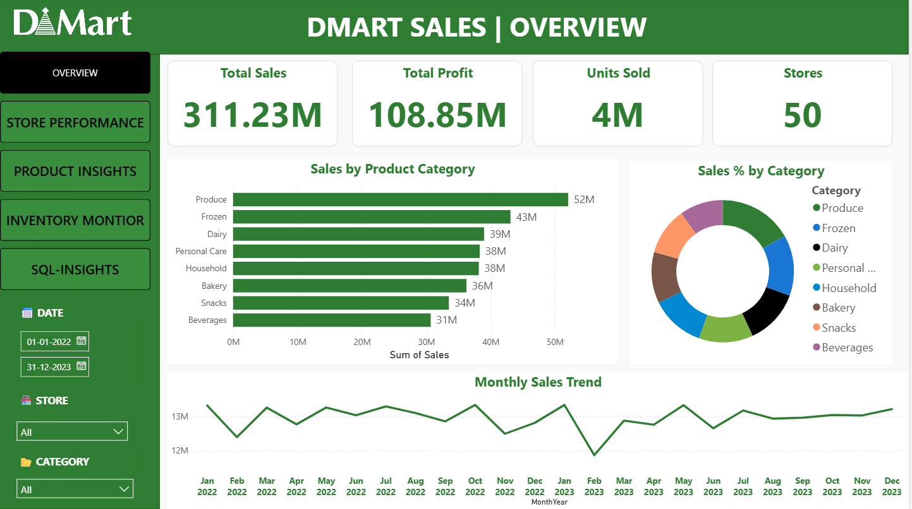
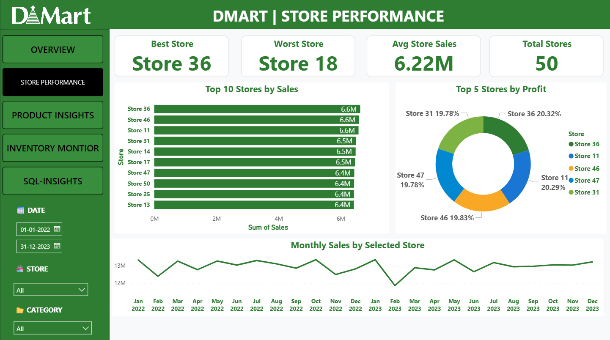
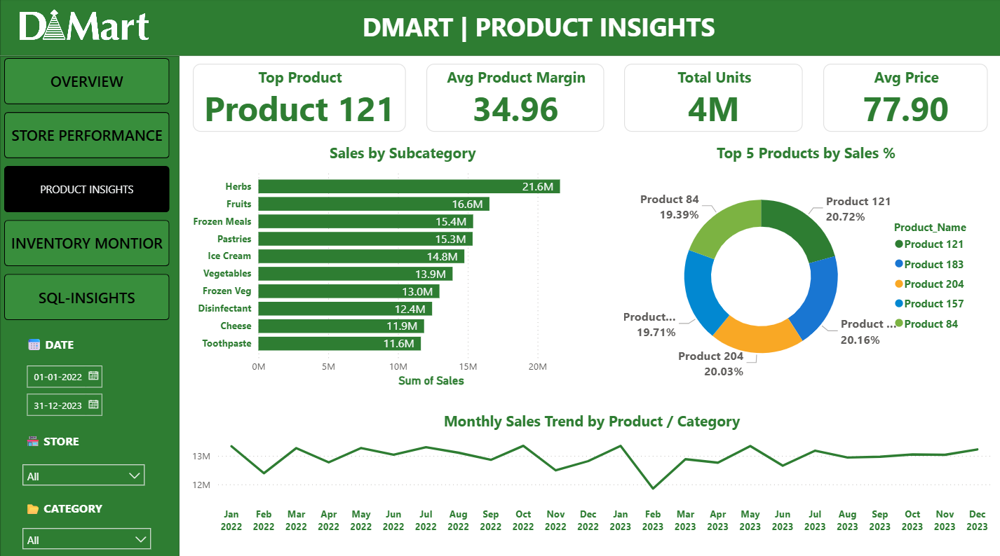
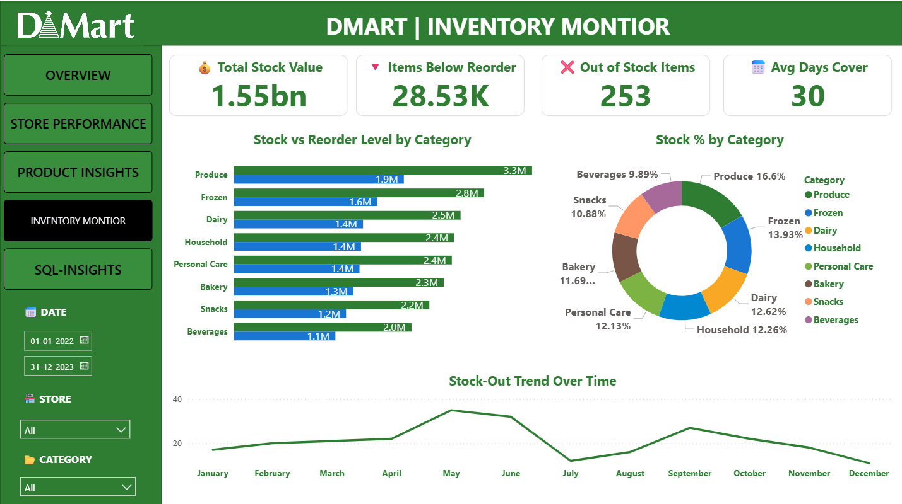
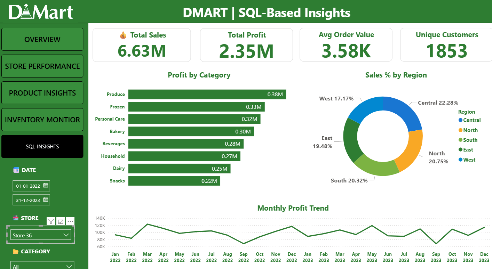

# 🛒 DMart Sales Dashboard - Power BI

This project is a **Power BI Dashboard** that provides a comprehensive analysis of DMart’s sales performance across various dimensions such as stores, products, inventory, and customers. Designed using **Power BI**, **SQL (MySQL)**, and **Excel**, the dashboard empowers stakeholders to monitor KPIs, optimize stock, and make data-driven decisions.

---

## 🔍 Key Features

- 💰 **Total Sales, Profit & Units**: Real-time KPI summaries  
- 📊 **Sales Breakdown**: Category-wise, subcategory, and regional performance  
- 🏪 **Store Performance**: Best vs worst stores by sales and profit  
- 🧴 **Product Insights**: Top-performing products with margin analysis  
- 📦 **Inventory Monitoring**: Track stock levels, reorder needs & out-of-stock items  
- 🧠 **SQL-Driven Insights**: Monthly profit trends, unique customers, regional stats  

---

## 📁 Dashboard Pages

1. **Overview**  
   - Company-wide KPIs: Sales, Profit, Stores  
   - Sales breakdown by category and trends  

2. **Store Performance**  
   - Top 10 stores by sales and profit  
   - Best and worst performing outlets  
   - Monthly trend per store  

3. **Product Insights**  
   - Sales by subcategory  
   - Top 5 products by revenue  
   - Monthly trend of selected products  

4. **Inventory Monitor**  
   - Stock vs reorder levels  
   - Out-of-stock trends  
   - Stock % by category  

5. **SQL-Based Insights**  
   - Profit by category  
   - Sales distribution by region  
   - Unique customer count & AOV  
   - SQL-generated monthly trends  

---

## ⚙️ Built With

- **Power BI Desktop**
- **MySQL** (SQL scripts for all KPIs and visualizations)
- **Excel** (source data cleaning & input)

---

## 📷 Screenshots

| Overview | Store Performance | Product Insights |
|----------|-------------------|------------------|
|  |  |  |

| Inventory Monitor | SQL Insights |
|-------------------|--------------|
|  |  |

---

## 📜 SQL Query Highlights

- KPIs: Total Sales, Total Profit, Units Sold, Store Count
- Store Analysis: Best/Worst Store, Avg Sales, Monthly trends
- Product Trends: Top 5 Products, Category Sales %, Margin %
- Inventory: Reorder checks, stock-out trends, days cover
- Region Insights: Sales %, Profit %, Unique Customers

📁 Full SQL queries available in: [`SQL-Scripts/dmart_master_queries.sql`](SQL-Scripts/dmart_master_queries.sql)

---

## 👨‍💻 Author

**Kunal Vishwakarma**  
🔗 [GitHub Profile](https://github.com/KunalVishwakarma55)  
🔗 [LinkedIn](https://www.linkedin.com/in/kunal-vishwakarma-18686636a/)

---

## 🏷️ Tags  
`#PowerBI` `#SQL` `#Excel` `#DataAnalytics` `#Dashboard` `#RetailAnalytics` `#PortfolioProject`
